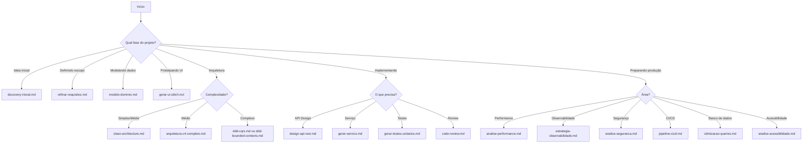

# Biblioteca de Prompts

Templates de prompts prontos para uso organizados por área.

---

## Como Usar

1. Copie o prompt da área desejada
2. Substitua os placeholders `[...]` com seu contexto
3. Cole na sua IA preferida (Claude, GPT, Gemini)
4. Valide usando o checklist no final de cada prompt

> **Dica**: Sempre inclua o conteúdo de `docs/CONTEXTO.md` para melhor resultado.

---

## Como Escolher o Prompt Certo



---

## Índice de Prompts

### 📋 Produto & Requisitos

| Prompt | Quando Usar | Nível |
|--------|-------------|-------|
| [discovery-inicial.md](./produto/discovery-inicial.md) | Início de projeto, ideia vaga | Simples |
| [refinar-requisitos.md](./requisitos/refinar-requisitos.md) | Após discovery, formalizar requisitos | Simples |

---

### 🎨 UX & Prototipagem

| Prompt | Quando Usar | Nível |
|--------|-------------|-------|
| [gerar-ui-stitch.md](./ux/gerar-ui-stitch.md) | Prototipar UI com Google Stitch | Simples |

---

### 🏗️ Arquitetura & Modelagem

| Prompt | Quando Usar | Nível |
|--------|-------------|-------|
| [modelo-dominio.md](./arquitetura/modelo-dominio.md) | Modelar entidades e relacionamentos | Simples |
| [arquitetura-c4-completo.md](./arquitetura/arquitetura-c4-completo.md) | Definir arquitetura com diagramas C4 | Médio |
| [clean-architecture.md](./arquitetura/clean-architecture.md) | Arquitetura limpa para projetos médios | Médio |
| [ddd-bounded-contexts.md](./arquitetura/ddd-bounded-contexts.md) | Definir contextos em DDD | Complexo |
| [ddd-cqrs.md](./arquitetura/ddd-cqrs.md) | DDD + CQRS para sistemas complexos | Complexo |

---

### 🔌 APIs

| Prompt | Quando Usar | Nível |
|--------|-------------|-------|
| [design-api-rest.md](./apis/design-api-rest.md) | Projetar API REST com OpenAPI | Médio |

---

### 💻 Desenvolvimento

| Prompt | Quando Usar | Nível |
|--------|-------------|-------|
| [gerar-servico.md](./desenvolvimento/gerar-servico.md) | Gerar código de serviços/use cases | Médio |
| [code-review.md](./desenvolvimento/code-review.md) | Revisar código de PRs | Médio |

---

### 🧪 Testes

| Prompt | Quando Usar | Nível |
|--------|-------------|-------|
| [gerar-testes-unitarios.md](./testes/gerar-testes-unitarios.md) | Criar testes unitários | Simples |
| [testes-integracao.md](./testes/testes-integracao.md) | Testes de integração com banco/APIs | Médio |
| [testes-e2e.md](./testes/testes-e2e.md) | Testes end-to-end com Playwright | Médio |
| [testes-performance.md](./testes/testes-performance.md) | Load testing com k6 | Médio |

---

### 🚀 Performance & Escalabilidade

| Prompt | Quando Usar | Nível |
|--------|-------------|-------|
| [analise-performance.md](./escalabilidade/analise-performance.md) | Identificar e corrigir gargalos | Médio |
| [otimizacao-queries.md](./database/otimizacao-queries.md) | Otimizar banco de dados e queries | Médio |

---

### 📊 Observabilidade

| Prompt | Quando Usar | Nível |
|--------|-------------|-------|
| [estrategia-observabilidade.md](./observabilidade/estrategia-observabilidade.md) | Configurar logs, métricas, traces | Médio |

---

### 🔐 Segurança

| Prompt | Quando Usar | Nível |
|--------|-------------|-------|
| [analise-seguranca.md](./seguranca/analise-seguranca.md) | Análise OWASP Top 10 | Médio |
| [threat-modeling.md](./seguranca/threat-modeling.md) | Modelagem de ameaças STRIDE | Médio |
| [revisao-lgpd.md](./seguranca/revisao-lgpd.md) | Conformidade LGPD/GDPR | Médio |
| [pentest-checklist.md](./seguranca/pentest-checklist.md) | Checklist de pentest para devs | Médio |

---

### ⚙️ DevOps

| Prompt | Quando Usar | Nível |
|--------|-------------|-------|
| [pipeline-cicd.md](./devops/pipeline-cicd.md) | Configurar CI/CD com GitHub Actions | Médio |
| [docker-compose.md](./devops/docker-compose.md) | Docker Compose multi-ambiente | Médio |
| [kubernetes-deploy.md](./devops/kubernetes-deploy.md) | Deploy Kubernetes com manifests | Complexo |
| [terraform-iac.md](./devops/terraform-iac.md) | Infrastructure as Code com Terraform | Complexo |

---

### ♿ Acessibilidade

| Prompt | Quando Usar | Nível |
|--------|-------------|-------|
| [analise-acessibilidade.md](./acessibilidade/analise-acessibilidade.md) | Verificar WCAG 2.1, screen readers | Médio |

---

## Estrutura dos Prompts

Todos os prompts seguem a mesma estrutura:

```markdown
# Prompt: [Nome]

> **Quando usar**: [Contexto]
> **Especialista**: [Link para especialista]
> **Nível**: [Simples/Médio/Complexo]

---

## Fluxo de Contexto
[Documentos de entrada e saída]

## Prompt Completo
[Prompt para copiar]

## Exemplo de Uso
[Exemplo preenchido]

## Resposta Esperada
[Exemplo de saída]

## Checklist Pós-Geração
[Validações do resultado]
```


