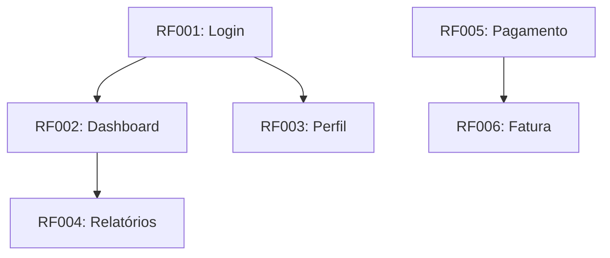

# Matriz de Rastreabilidade de Testes: [Nome do Sistema]

**Versão:** 1.0  
**Data:** YYYY-MM-DD  
**QA Responsável:** [Nome]  
**Projeto:** [Nome do Projeto]

---

## Visão Geral

Esta matriz garante rastreabilidade completa desde os requisitos de negócio até os casos de teste, permitindo análise de impacto, gestão de riscos e validação de cobertura ponta a ponta.

### Objetivos Principais
- Garantir 100% dos requisitos críticos cobertos por testes
- Permitir análise de impacto de mudanças
- Identificar gaps de cobertura rapidamente
- Facilitar auditorias de qualidade
- Suportar decisões de release baseadas em dados

---

## Sumário Executivo

| Métrica | Valor | Meta | Status |
|--------|-------|------|--------|
| **Total de Requisitos** | [XX] | - | 📊 |
| **Requisitos Cobertos** | [XX] | 100% | ✅ [XX]% |
| **Total de Casos de Teste** | [XX] | - | 🧪 |
| **Testes Automatizados** | [XX] | 90% | 🤖 [XX]% |
| **Cobertura de Código** | [XX]% | 80% | 📈 |

---

## Matriz Principal: Requisitos → User Stories → Testes

| ID Requisito | Descrição Resumida | Prioridade | User Stories | Casos de Teste | Tipo Teste | Status | Cobertura |
|-------------|-------------------|------------|--------------|----------------|------------|--------|-----------|
| **RF001** | [Descrição curta] | Alta | US001, US002 | TC001, TC002, TC003 | Unit/E2E | ✅ Coberto | 100% |
| **RF002** | [Descrição curta] | Média | US003 | TC004, TC005 | Integration | ✅ Coberto | 100% |
| **RF003** | [Descrição curta] | Alta | - | - | - | ❌ Não coberto | 0% |
| **RF004** | [Descrição curta] | Baixa | US004 | TC006 | E2E | 🔄 Em andamento | 60% |
| **RNF001** | Performance < 2s | Crítica | - | TC-PERF-001 | Performance | ⏳ Pendente | 0% |
| **RNF002** | OWASP Top 10 | Crítica | - | TC-SEC-001, TC-SEC-002 | Security | ⏳ Pendente | 0% |

---

## Análise de Cobertura

### Por Tipo de Requisito

#### Requisitos Funcionais
| Status | Quantidade | % do Total | Cobertura Testes |
|--------|------------|------------|------------------|
| ✅ Totalmente Cobertos | [X] | [X]% | 100% |
| 🔄 Parcialmente Cobertos | [X] | [X]% | 50-99% |
| ❌ Não Cobertos | [X] | [X]% | 0% |
| **Total Funcionais** | **[X]** | **100%** | **[X]%** |

#### Requisitos Não Funcionais
| Status | Quantidade | % do Total | Tipo |
|--------|------------|------------|------|
| ✅ Cobertos | [X] | [X]% | Performance/Segurança |
| ⏳ Pendentes | [X] | [X]% | Disponibilidade/Usabilidade |
| **Total Não Funcionais** | **[X]** | **100%** | - |

### Por Tipo de Teste

| Tipo de Teste | Quantidade | % Automatizados | Pass Rate | Cobertura Código |
|---------------|------------|-----------------|-----------|------------------|
| **Unitários** | [XX] | [XX]% | [XX]% | [XX]% |
| **Integração** | [XX] | [XX]% | [XX]% | [XX]% |
| **E2E** | [XX] | [XX]% | [XX]% | - |
| **Performance** | [XX] | [XX]% | [XX]% | - |
| **Segurança** | [XX] | [XX]% | [XX]% | - |

---

## Matriz Detalhada: User Stories → Código → Testes

| US ID | Módulo/Arquivo | Testes Unitários | Testes Integração | Testes E2E | Cobertura | Complexidade | Status |
|-------|----------------|------------------|-------------------|------------|-----------|--------------|--------|
| US001 | `src/modules/user/` | user.service.spec.ts | user.api.spec.ts | user.e2e.spec.ts | 85% | Média | ✅ |
| US002 | `src/modules/order/` | order.service.spec.ts | order.api.spec.ts | order.e2e.spec.ts | 78% | Alta | ✅ |
| US003 | `src/modules/payment/` | - | - | - | 0% | Alta | ❌ |
| US004 | `src/modules/report/` | report.service.spec.ts | - | report.e2e.spec.ts | 45% | Média | 🔄 |

---

## Análise de Gaps e Riscos

### Requisitos Críticos sem Cobertura

| ID | Requisito | Risco | Impacto | Ação Imediata | Responsável | Prazo |
|----|-----------|-------|---------|----------------|-------------|-------|
| RF003 | [Descrição] | Alto | Bloqueia release | Criar US e TC prioritários | [Nome] | [Data] |
| RNF001 | Performance < 2s | Crítico | Afeta UX | Implementar testes de carga | [Nome] | [Data] |
| RNF002 | OWASP Top 10 | Crítico | Segurança | Scanner automatizado | [Nome] | [Data] |

### User Stories sem Testes Adequados

| US ID | Descrição | Gap Identificado | Risco | Ação Corretiva |
|-------|-----------|------------------|-------|----------------|
| US003 | Pagamentos | Sem testes unitários/integração | Financeiro | Criar suite completa |
| US004 | Relatórios | Falta testes de integração | Dados | Completar cobertura |

### Testes Órfãos ou Obsoletos

| TC ID | Descrição | Problema | Impacto | Ação |
|-------|-----------|----------|---------|------|
| TC999 | Teste legado | Sem requisito associado | Manutenção | Arquivar ou associar |

---

## Dependências entre Requisitos

---

## Métricas Avançadas e Tendências

### Evolução da Cobertura (Últimas 4 Semanas)

| Semana | Cobertura Requisitos | Cobertura Código | Pass Rate | Bugs Encontrados |
|--------|---------------------|-----------------|-----------|------------------|
| Semana 1 | [XX]% | [XX]% | [XX]% | [XX] |
| Semana 2 | [XX]% | [XX]% | [XX]% | [XX] |
| Semana 3 | [XX]% | [XX]% | [XX]% | [XX] |
| Semana 4 | [XX]% | [XX]% | [XX]% | [XX] |
| **Tendência** | 📈/[XX]% | 📈/[XX]% | 📈/[XX]% | 📉/[XX]% |

### Indicadores de Qualidade

| KPI | Meta | Atual | Status | Observações |
|-----|------|-------|--------|-------------|
| **Time to First Test** | < 2 dias | [X] dias | ✅/❌ | Tempo para criar primeiro teste |
| **Test Automation Rate** | > 90% | [XX]% | ✅/❌ | Percentual de automação |
| **Flaky Test Rate** | < 1% | [XX]% | ✅/❌ | Testes instáveis |
| **Mean Time to Fix** | < 4 horas | [X] horas | ✅/❌ | Tempo médio para corrigir |
| **Coverage Growth** | > 5%/semana | [XX]% | ✅/❌ | Crescimento semanal |

---

## Análise de Impacto de Mudanças

### Mudanças Recentes e Impacto

| Data | Mudança | Requisitos Impactados | Testes Afetados | Status Mitigação |
|------|---------|----------------------|-----------------|------------------|
| YYYY-MM-DD | [Descrição] | RF001, RF002 | TC001, TC002, TC003 | ✅ Atualizado |
| YYYY-MM-DD | [Descrição] | RNF001 | TC-PERF001 | 🔄 Em andamento |

### Previsão de Impacto Futuro

| Planejado | Requisitos Impactados | Complexidade | Esforço Estimado | Risco |
|-----------|----------------------|--------------|------------------|-------|
| [Feature] | RF005, RF006 | Alta | 3 dias | Médio |
| [Refactor] | Módulo X | Média | 2 dias | Baixo |

---

## Recomendações Estratégicas

### Ações Imediatas (Próxima Semana)
1. **Priorizar cobertura** de RF003 (crítico sem testes)
2. **Automatizar testes manuais** restantes
3. **Configurar monitoramento** contínuo de coverage
4. **Revisar testes flaky** para estabilizar pipeline

### Ações de Curto Prazo (Próximo Mês)
1. **Implementar teste de mutação** para validar qualidade
2. **Otimizar performance** da suite de testes
3. **Expandir testes de segurança** (OWASP completo)
4. **Integrar com pipeline** de deploy automatizado

### Ações de Longo Prazo (Próximo Trimestre)
1. **Implementar testes visuais** (regressão UI)
2. **Expandir para testes de carga** contínuos
3. **Integração com monitoring** em produção
4. **Machine Learning para** priorização de testes

---

## Checklist de Rastreabilidade

- [ ] Todo RF tem pelo menos 1 US associada
- [ ] Toda US tem critérios de aceite em Gherkin
- [ ] Todo critério de aceite tem TC correspondente
- [ ] Todos os TCs estão implementados e passando
- [ ] RNFs têm testes específicos (performance, segurança)
- [ ] Matriz atualizada após cada sprint

---

## Exportação / Links

- Requisitos: [Link para requisitos.md]
- Backlog: [Link para backlog.md]
- Plano de Testes: [Link para plano-testes.md]
- Board (Jira/Linear): [Link]

---

## Changelog

| Versão | Data | Autor | Mudanças |
|---|---|---|---|
| 1.0 | YYYY-MM-DD | [Nome] | Versão inicial |
